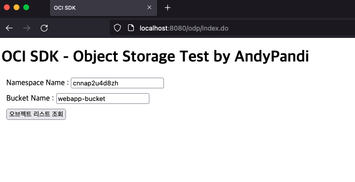
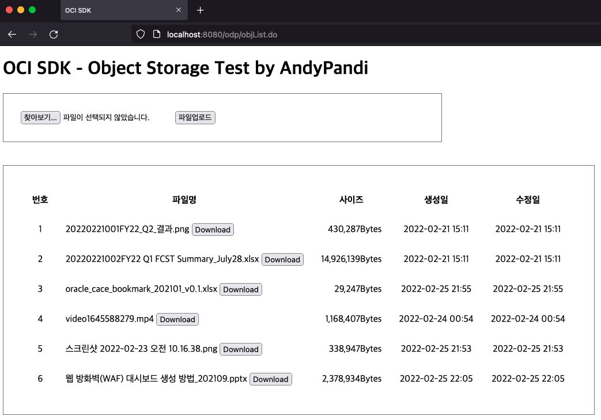
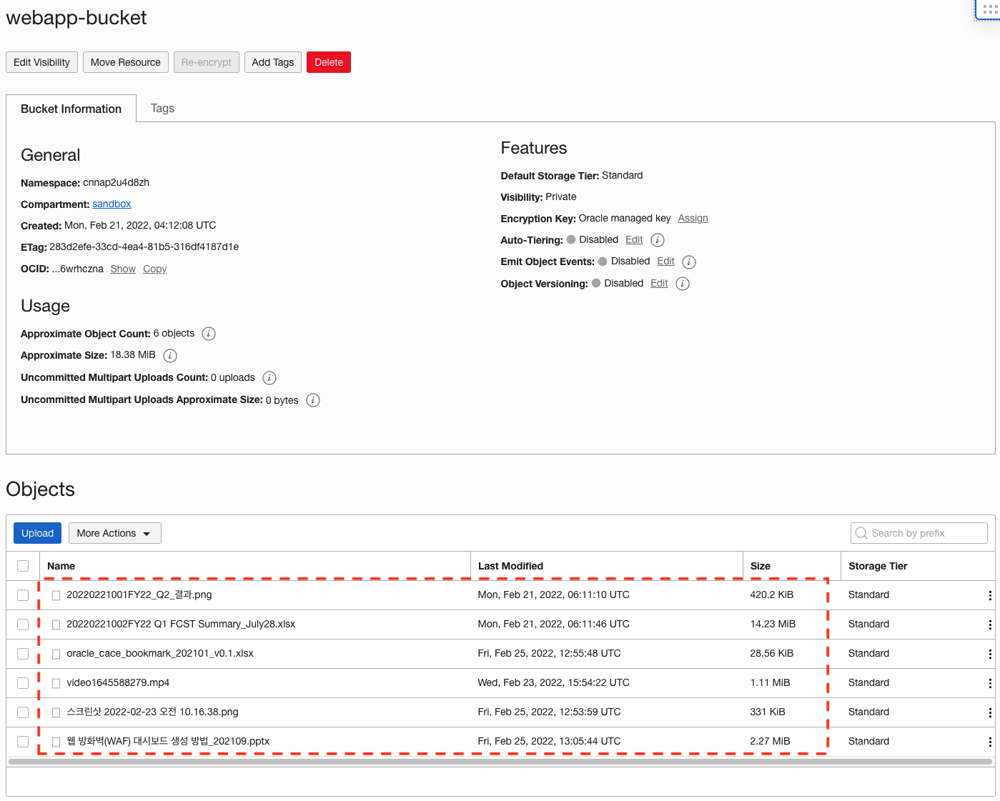

# 오라클 클라우드 SDK 를 사용한 오브젝트 스토리지 활용

OCI (Oracle Cloud Infrastructure) 의 SDK를 이용한 오브젝트 스토리지 사용 매뉴얼 입니다.

Spring boot 로 만든 단순한 Web Application에서 OCI 오브젝트 스토리지로 파일 업/다운로드 테스트 해봤습니다.

### **Web Application Spec**

- Java 1.8 , Maven 8, Spring Boot 2.6.4

### **실행화면 캡처**

- 인덱스 화면 : index.do

  

- 오브젝트 리스트 / 오브젝트 업로드 / 오브젝트 다운로드 회면 : objList.do

  

- Oracle Cloud Console : 오브젝트 스토리지 (오브젝트 리스트 조회 정상여부 확인)

  

### **메인소스**
com.odp.controller.ObjStorageController.java [[link]](./src/main/java/com/odp/controller/ObjStorageController.java "ObjStorageController.java")

- getObjectList: Object List 조회

- downloadObject: Ojbect Download

- uploadObject: Object Upload

### **참고자료**

- 공식매뉴얼: https://docs.oracle.com/en-us/iaas/Content/API/SDKDocs/javasdk.htm#SDK_for_Java
- Project Home: https://github.com/oracle/oci-java-sdk/releases
- 예제모음: https://github.com/oracle/oci-java-sdk/tree/master/bmc-examples/src/main/java
- SDK Java Docs: https://docs.oracle.com/en-us/iaas/tools/java/2.16.0/
- Maven Repository: https://search.maven.org/search?q=g:com.oracle.oci.sdk
